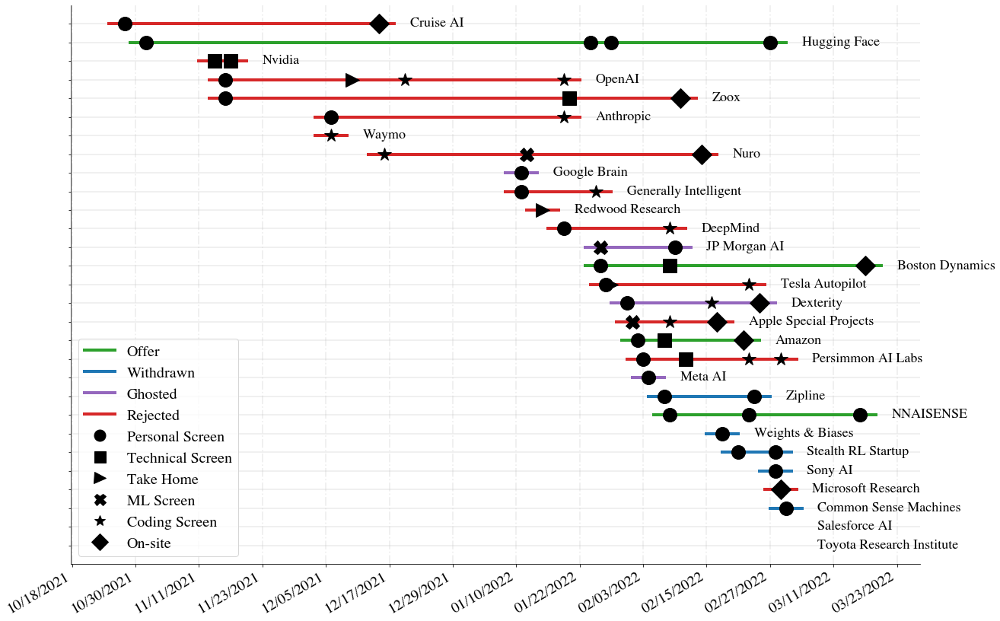
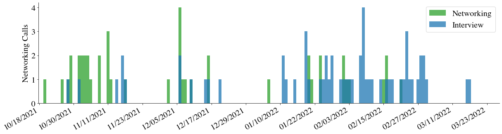

# Job Search Visualizer

This is a quick tool I made to visualize the calls I made during my thorough job search.
It returns two plots.
1. a timeline for each company with per-interview types.

2. a bar plot showing relative density of networking and interview calls.

## Usage
To use, please make a copy of this [google sheet](https://docs.google.com/spreadsheets/d/1ZlqblM1N8Qqkmy8EP_YSXb9cVtV4z-fKQ7nMWXMLuQc/edit?usp=sharing).

